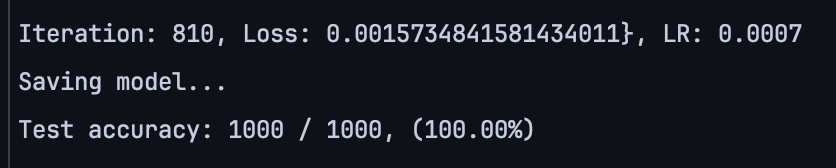
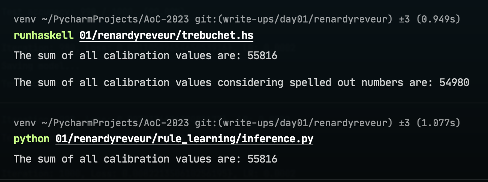

# Can Neural Networks Learn Rules?

Jeehoon Kang

## Introduction

2023년도 AoC는 플레인베이글의 AI팀, 개발팀, 콘텐츠팀 등 다양한 백그라운드의 사람들이 참여하는 즐거운 연말 행사가 되고 있다. 🎅

Advent of Code는 이름 자체에 'Code'가 들어가 개발자 혹은 개발에 관심 있는 사람에게만 appeal 하는 것 같아 보일 수 있다. \
하지만 25일간 펼쳐지는 대장정에는 나름의 서사가 존재하고, 그 서사는 매년 크리스마스 준비를 어떻게 해내는지 도무지 모르겠는 incompetent 한 엘프들의 mishap 들을 도와주는 우리의 역할을 이입하게 하고 하나의 세계관으로서 많은 이들의 상상력을 자극한다.

*바보 같은 산타의 엘프들... made w/ Stable Diffusion Turbo*

¯\\_(ツ)_/¯

[Reddit](https://www.reddit.com/r/adventofcode/)에서 해당 세계관에 너무 이입한 사람들의 재능낭비(?)를 몇가지 볼 수 있는데

예를 들면:

- 귀여운 엘프들의 끝나지 않는 실수를 그림으로 표현한다거나

    - [This is what I saw in my head when reading today’s instructions](https://www.reddit.com/r/adventofcode/comments/188kfny/2023_day_01_this_is_what_i_saw_in_my_head_when/)
  
    - [yet another blunder has occurred on the workshop today](https://www.reddit.com/r/adventofcode/comments/188f7zx/2023_day_01_yet_another_blunder_has_occurred_on/)

- [터미널에서 이쁘게 visualize 한다거나](https://www.reddit.com/r/adventofcode/comments/188kfny/2023_day_01_this_is_what_i_saw_in_my_head_when/)

- [게임기, 계산기 내에서 문제를 푼다거나](https://www.reddit.com/r/adventofcode/comments/188bpfg/2023_day_1_playdate_cranked_solution/)

- 이외에도 수천 가지 밈들이나, 잘 알려지지 않은 프로그래밍 언어들을 활용한 풀이, 모듈러 Synth등을 활용해서 음악적(?)으로 푸는 행위 등 

관심 있는 자신만의 무언가에 연결해서 **표현**을 하는 사람들이 많다.

그래서 올해는 단순히 문제를 푸는 것만을 넘어서 이런 '표현'을 통해 팀과 소통하고 또 AI 팀의 일원으로서 다른 팀들에게 AI 적인 무언가를 보여주고 싶다는 생각으로 이 간단한 프로젝트를 진행해 보았다.

## Rule Learning

논리적인 단계와 deterministic 한 행위를 신경망이 배울 수 있을까?

프로그래밍 퍼즐의 풀이는 흔히 **규칙에 맞는 과정**을 쌓아나가 **정해진 하나의 답**을 만들어가는 것으로 인식하고 있다. \
그에 비해 신경망이라는 것은 다량의 데이터 속의 내재적인 패턴에 대한 *확률적인 학습과 추론*을 통해 결과를 도출한다는 인식이 있다. 
> - 배치 단위의 평균적인 미분값을 통해 파라미터를 noisy 하게 업데이트하는 것부터
> -  특정 task 들에서 softmax 를 활용한 결괏값 도출은 마치 신경망을 이산 확률 모델로서 활용한다거나
> -  그러한 모델들의 목적 함수로서 예측과 실측 확률 분포들의 상대적 정보량 차이를 최소화하는 개념
> - VAE 같은 구조 속에서는 latent factor를 예측하고
> - 데이터의 통계치들은 학습 피쳐로서 활용되는 등 
> 
> 통계적인 개념이 신경망의 학습과 추론에 깊게 관여한다.

하지만 신경망은 단순히 하나의 overly-parameterized 된 복잡한 함수일 뿐이다. \
입력값에 대한 단계적인 선형 변환과 비선형적 projection 의 연속을 통해 universal function approximator 의 역할을 수행할 수 있게 된다. 👐

--

**논리적인 구조를 단계적으로 합성해 나가며 문제를 풀어나가는** classical programming과 🏗️ **인풋값과 결과값이라는 시작과 끝 사이의 최적화된 경로를 가정하고 데이터를 통해 그 길을 찾아가는** 딥러닝의🏕️ 방법을 고민하면 떠오르는 analogy가 하나 있다.

> 마치 과거와 현재를 가지고 다음 스텝을 예측해 나가는 Newtonian mechanics와 그와 equivalent 한, 그러나 일종의 reformulation인: 시작과 끝의 정의 속에 principle of least action을 가정하고 그 원리를 따라가는 Lagrangian mechanics와 같은 느낌이 든다.

그 둘의 역학적 개념이 관점의 차이일 뿐 다른 것이 없는 것처럼, 나는 딥러닝이 일종의 새로운 프로그래밍 패러다임이라는 것을 팀에게 인지시키고 싶다.
논리를 직접 구현하기보단, 

>[!NOTE]
> 논리가 표현될 수 있는 하나의 복잡한 장(stage)을 만들어 주고 그 안에서 스스로만의 '논리'가 형성되도록 guide 하는 것이 딥러닝이 아닌가?

*자세한 내용은 *'From the Hume-ean to the Teleological'* 이라는 제목을 가진 추후 블로그 글을 통해 더 다뤄보고자 한다. Watch out for this space!*

더 나아가서는 최적화된 논리 구현과 그에 대치될 수 있는 올바른 구조 속에 학습된 신경망은 같은 것을 표현하고 있는 것일지 모른다. 그렇다면 양쪽이 서로의 관점에서 얻어 갈 수 있는 부분들이 있지 않을까?

신경망 입장에서는 학습에 의해 내재적으로 정립된 black box를 논리 구현과 비교하며 일종의 explainable AI를 끌어낼 수 있지 않을까?

논리 구현 입장에서는 신경망이 학습한 내재적인 패턴을 통해 더 효율적인 실제 추론 및 연산을 만들어 볼 수 있지 않을까?

--

그렇기에 AoC 2023, Day 1의 첫 번째 파트, alphanumeric 철자들로 이루어진 스트링에서 첫 번째와 마지막 숫자를 찾는 '퍼즐'을 신경망으로 풀어보고 싶었다.

> 푼 방법은 다음과 같다.

> 1. 학습 **데이터 생성기**를 만들었다.
>    - 최대 길이 60 이하의 alphanumeric 스트링을 무작위로 생성하고, 처음과 마지막 숫자를 타겟값으로 리턴한다.
>    - 배치 단위 모델 학습을 위해 인풋 값은 padding 토큰을 하나 만들어 최대 길이 60으로 맞춰줬다.
> 2. **시퀀스를 인풋으로 받아들이는 모델**이여야 한다. 그리고 시퀀스 내의 **위치에 대한 개념**이 필요하다.
> 3. 모델 아웃풋으로는 2개의 **확률 분포**를 도출하게 했다. (첫 번째 숫자의 클래스에 대한 확률 분포, 마지막 숫자의 클래스에 대한 확률 분포)
> 4. 아웃풋으로 나온 두 개의 확률 분포와 실 타겟 값의 one-hot encoding 된 타겟 분포 사이 **cross entropy loss**의 합을 계산한다.
> 5. Adam optimizer를 활용하여 배치 단위로 신경망 파라미터를 업데이트했다.
> 6. 학습 중간중간 AoC Input에 대한 accuracy 테스트를 진행했다.
> 7. Accuracy가 지속해서 100%가 나와 converge 하면 학습을 종료하고, 학습된 모델을 저장했다.
> 8. 학습된 모델을 가지고 추론 코드를 작성하여 AoC Input에 대한 결과를 도출했다.

> [!IMPORTANT]
> 자세한 사항은 `01/renardyreveur/rule_learning` 안의 코드를 확인하기를 바란다.

## What I've Learned

JAX를 활용해서 데이터 생성기, 모델(activations, layers, normalizations), 가중치 초기화, loss 함수, optimizer, scheduler, 학습 루프, 테스트 코드를 작성하였고,
Flax나 Haiku와 같은 추가 dependency 활용을 하나도 안 했다. (Convergence 테스트를 위해 Flax로 모델을 다시 구현하여 비교하는 용도로 사용했을 뿐)

- 오랜만에 학습에 관여하는 모든 요소를 직접 구현하면서 (autograd 및 병렬화 코드 이외에) 전체적인 내용을 복습하고 제일 기초적인 부분부터 나의 이해를 확인해 볼 수 있었다.

- JAX는 마음에 든다. AoC도 Haskell처럼 순수 함수형 언어로 풀고 있는데, JAX도 비슷한 성질을 가져가기에 잘 어울렸다고 생각한다. [구글 내부 프로젝트일 때 JAX는 한때 Haskell 프로젝트였다는...](https://github.com/google/jax/issues/185)

### **모델링/학습 관련 Trial and Error들**
  - 기본적으로는 Attention 기반 시퀀스 인코더를 만들었다. 
  
  - 우선 초반에는 따로 positional encoding을 활용하지 않았는데, 문제 자체가 시퀀스 내의 특정 철자의 위치가 중요했기에 위치 정보에 대한 exposure가 필요하다고 생각했다. 두 가지가 빠른 convergence를 끌어내는 데 기여했다.
     1. Learned positional embedding을 추가하여 시퀀스 내 위치 정보를 학습하게 했다. 🧘
     2. 두 확률 분포를 만들어 내기 전 시퀀스에 대한 인코딩 정보를 처리하고자 할 때 모든 타임 스텝에 대해서 평균 잡아 최종 인코딩을 만드는 것 보다 모든 타임 스텝을 concat하고 선형 변환을 시켜 위치에 대한 개념이 사라지지 않도록 했다. (B, S, D) -> (B, avgDoverS) 보다 (B, S, D) -> (B, S*D) -> (B, D)가 예상대로 더 좋은 성능을 보였다.
  
  - LayerNorm 위치가 중요했다. 처음에는 vanilla로 post-LN을 진행했는데, pre-LN이 훨씬 stable하고 convergence가 빨랐다. 그런 논문이 있다는 것은 알았는데, 실제로 직접적으로 경험해 본 것은 처음인 것 같다. ⏮️
  
  - 당연한 이야기지만, 모델 가중치 초기화 방법이 엄청나게 큰 영향을 미친다. 초반에는 xavier uniform 방법대로 구현해 보았으나, lecun normal 방식으로 바꿔보니 훨씬 빠른 convergence에 도달할 수 있었다. ✴️
  
  - Attention QKV 가중치들과 연산을 정의할 때 초반에는 (model_dim, model_dim*3) 짜리 가중치 하나를 만들어 추후에 split 및 num_heads 차원을 추가하여 reshape 해서 구현했다. 문제없이 잘 학습이 되긴 했지만, Flax로 따로 구현해 본 모델과 convergence 속도 차이를 보였다.
   궁금해서 `MultiHeadAttention` 쪽 Flax implementation을 살펴보았는데, Q, K, V를 나누고 심지어 미리 head로 나뉜 (B, S, H, D//H) 형태로 가중치를 가지고 연산하길래, 그렇게 구현을 바꾸고, einsum 노테이션으로 행렬곱 연산을 정의했다. 오 신기하게도 convergence 속도가 이제 Flax와 비슷해졌다. (아직 정확하게 왜 그러는지는 잘 모르겠다..)

  - 위의 모든 내용이 잘 작동해도 test accuracy에서 99.5%를 보여 주었다.. 실패 사례들을 살펴보니 긴 스트링에 숫자가 1, 2개 정도로 별로 없고, 앞이나 뒤쪽에 치우쳐 있다거나 연속된 숫자 3개만 긴 스트링 일부에 딱 존재한다거나 하는 엣지 케이스들이었다. 데이터 생성기에서 해당 엣지 케이스의 representation이 부족한 것으로 판단해 10%의 확률로 그러한 엣지 케이스 비슷한 데이터를 생성하게 하고 학습하니 100%로 도달했다.

## Results!

7만 개 정도의 파라미터를 가진 신경망을 가지고 Batch size 512를 활용하여 810 iteration 만에 안정적인 100% accuracy에 도달했다. 즉 대략 40만 개의 예제를 보고 패턴을 깨우친 것이다!

실질적인 모델 튜닝 및 하이퍼파라미터 튜닝을 진행하면 훨씬 적은 모델 크기와 예제들로 학습 할 수 있었을 것으로 생각된다. 하지만 this was just for demonstration이라 여기서 마무리 지으려고 한다.

랜덤으로 생성되는 데이터를 가지고, 보지 못한 AoC 데이터에 대해 일반화에 성공하여 실제로 하스켈 코드와 동일한 결과를 도출하는 것을 볼 수 있다:

 이 모델에도 당연히 한계가 있다. 정말 이 작고도 작은 scope를 위해 학습한 것이라 60 철자 이상의 예제에 대해서는 처리하지 못한다.
또한 AoC 데이터에 '0' 철자가 존재하지 않는 것을 가지고, 1..9사이의 확률 분포를 만들게끔 하여 '0' 또한 처리를 못 한다. 마지막으로 확률 분포에서 greedy sampling을 해서 최종 결과를 얻지만, 모든 케이스에 대해 정합성을 가진다는 claim을 하기 어렵다.

하지만 문제가 달라지면 그에 맞춰 문제를 해결하는 것이 AI 엔지니어든, 개발자든 누구든지 항상 해야 하는 일이다. 앞으로도 재미난 실험을 통해 AI / 딥러닝의 면모를 팀에게 더 보여주고 소통을 끌어내고자 한다.
다음번에는 Deep Reinforcement Learning 개념을 활용하여 문제를 풀어보고 싶다는 염원을 적으며 글을 마치고자 한다. 🦊
