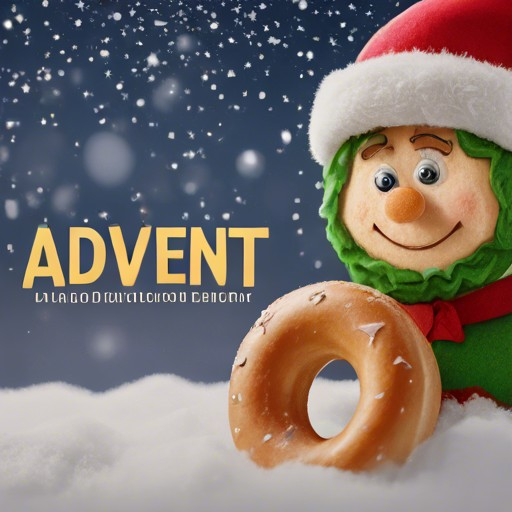

# [AoC-2023][aoc-2023]

[][aoc-official] [][pbagel-official]  

[About](#about) | [Awesome solutions](#awesome-solutions) | [License](#license)

## About

🥯플레인베이글 [Advent of Code][aoc-official] 🎄챌린지 기록을 위한 저장소 입니다.

보통이라면 어드밴트 캘린더를 하나 사서 가족이랑 매일 각 날짜 속에 숨겨진 작은 초콜릿 🍫하나 먹으며 성탄절을 맞이하겠지만, 베이글러는 다릅니다! [Eric Wastl][eric-wastl]님이 2015년부터 매년 직접 혼자 준비해주시는 크리스마스의 센세이션 [*Advent of Code*][aoc-official]를 2023년에 재밌게 진행합니다! :tada:

> [!NOTE]
> Advent of Code란?
> 소규모 프로그래밍 퍼즐 어드밴트 캘린더입니다. 원하는 모든 프로그래밍 언어로 해결할 수 있고, 다양한 난이도의 문제들이 준비되어 있습니다. 

## Awesome solutions

|                                         Name                                          |             Author             | Languages |   Keywords    |
|:-------------------------------------------------------------------------------------:|:------------------------------:|:---------:|:-------------:|
| [Day 01/Can Neural Networks Learn Rules?](./01/renardyreveur/rule_learning/README.md) | [renardyreveur][renardyreveur] |  Python   | rule-learning |

> [!NOTE]
> [Awesome solutions](#awesome-solutions)에 자신의 풀이를 추가해주세요!
> 참여 방법은 [CONTRIBUTING.md](./CONTRIBUTING.md)를 참고해주세요. :smile: 

## License

MIT 라이센스를 준수합니다. [LICENSE](LICENSE)에서 자세한 정보를 확인할 수 있습니다.

## Contact

- [slack/plain-bagel/aoc-2023](https://plainbagel.slack.com/archives/C067RSCDC78)

[aoc-2023]: https://github.com/plain-bagel/AoC-2023

[aoc-official]: https://adventofcode.com

[eric-wastl]: https://twitter.com/ericwastl

[pbagel-official]: https://pbagel.com

[renardyreveur]: https://github.com/renardyreveur
